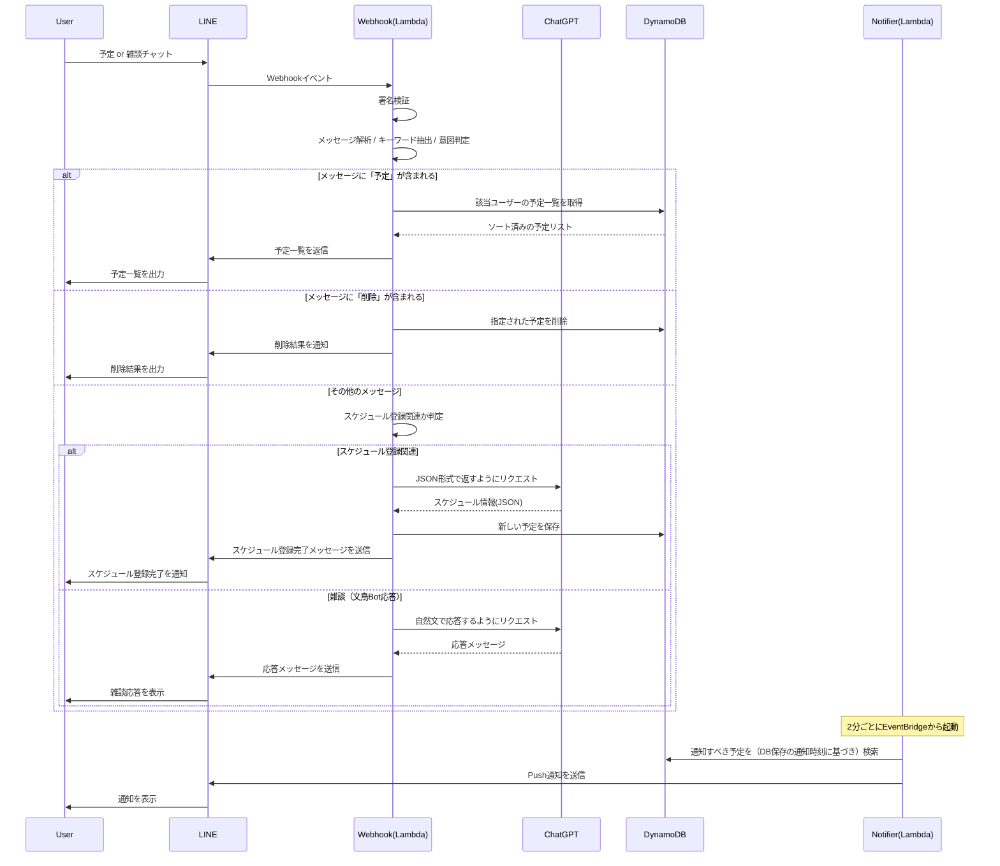
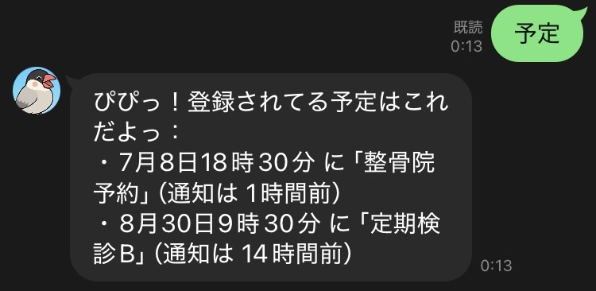
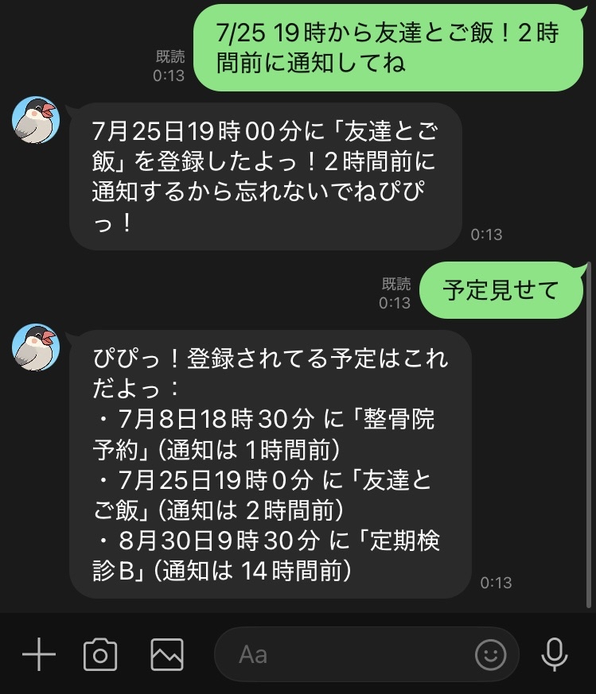
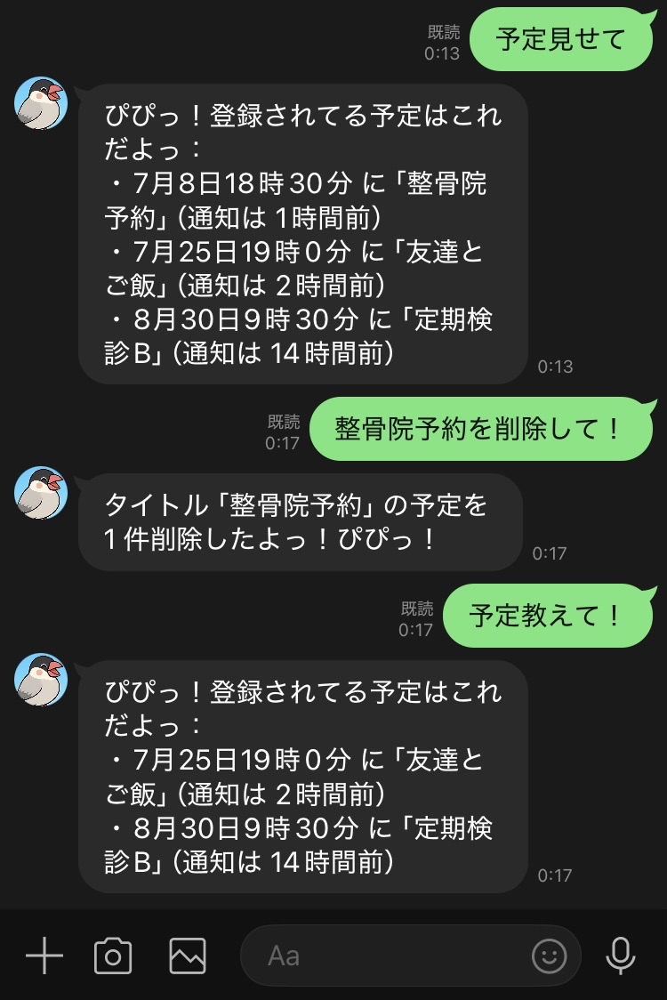
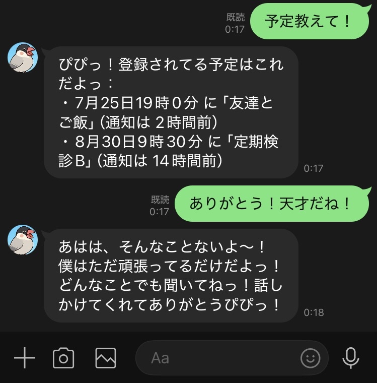

# LINE予定管理おしゃべり文鳥Bot 🐦  
*A talking Java sparrow LINE bot that manages your schedule with the help of ChatGPT!*

---

## 📌 概要 / Overview

このBotは、**LINEで予定を管理できるかわいいおしゃべり文鳥**です。  
ユーザーのチャット内容を**ChatGPT**（gpt-3.5）に解析させ、予定の追加・一覧・削除を実現しています。  
予定に関係ない話題には、文鳥がのんびりおしゃべりで返してくれます🐦

---

## 🔧 機能一覧 / Features

| 機能             | 説明                                                                 |
|------------------|----------------------------------------------------------------------|
| 📝 予定登録      | ChatGPTが予定っぽいメッセージを解析し、JSON形式で予定をDynamoDBに保存 |
| 📅 予定一覧      | 「予定」と送ると、ユーザーの登録予定を日時順に一覧で返信               |
| ❌ 予定削除      | 「○○消して」などの自然な表現で予定を削除可能                           |
| 🔔 通知機能      | EventBridge → Lambda → LINE Push通知で、予定時間をお知らせ            |
| 💬 おしゃべり    | 雑談モードではChatGPTが文鳥になりきってトーク                          |
| 🔐 セキュリティ  | LINE署名検証によるリクエスト検証（hashによる署名確認）                  |

---

## 🧠 処理の流れ / Bot Architecture



---

## 📂 ディレクトリ構成 / Project Structure

※ 以下は便宜的にファイル名（.py）で表現していますが、実際はAWS Lambda関数名としてデプロイされています。またこれは将来的な構成予定です。現在は `README.md` のみ整備済みで、他のファイル・関数は準備中です。
```
line-chatbird-planner/
├── src/
│   ├── linewebhookhandler.py              # 署名検証・GPT連携・DB処理など集約（Lambda関数「LineWebhookHandler」）
│   └── send_scheduled_notifications.py    # 通知処理用Lambda（Lambda関数「SendScheduledNotifications」）
├── images/
│   ├── register_example.png
│   ├── list_example.png
│   ├── delete_example.png
│   └── chat_example.png
├── requirements.txt
├── README.md
├── LICENSE
└── .gitignore
```
※ 現時点では、GPT連携処理・署名検証などはすべて linewebhookhandler.py 内にまとめられています。
今後のリファクタリングでモジュール分割を予定しています。

---

## 🔐 環境変数 / Environment Variables

このBotは以下の環境変数を AWS Lambda に設定して動作します。  
セキュリティのため、各種キー・トークンはコード内ではなく環境変数から取得しています。

| 変数名                | 用途                           |
|------------------------|--------------------------------|
| `LINE_CHANNEL_SECRET`  | LINE Messaging APIの署名検証用シークレット |
| `LINE_CHANNEL_ACCESS_TOKEN` | LINE Botからの返信・Push通知用 |
| `OPENAI_API_KEY`       | ChatGPT（gpt-3.5）との連携用APIキー |

これらはすべて **AWS Lambdaの「環境変数」セクション** に設定してください。

---

## 🧪 使用例 / Example Usage

以下は実際に動作したLINE Botとのやりとりのスクリーンショットです。

### 📅 予定一覧の取得



### 📥 予定の登録




### ❌ 予定の削除 



### 💬 雑談への応答



---

## 🔧 改修予定 / Planned Fixes

以下は今後対応予定のコード面での改修・整理ポイントです。

- 🔄 **署名検証ロジックの分離**  
  現在は `linewebhookhandler.py` に直接書かれているが、別モジュール（`signature_verifier.py` など）に切り出す予定。

- 🧠 **ChatGPTとの連携処理の関数化**  
  Webhook処理と一体化しているため、役割ごとに分離し、再利用性と可読性を高める。

- ⚙️ **DynamoDB設計の見直し（ソートキー）**  
  現在は `timestamp` をソートキーとしており、アプリ側で日時ソート処理が必要になっている。  
  初期設計で `datetime` をソートキーにしておけばDynamoDBで自然な順序が得られたため、  
  今後はキー構造の再設計を検討したい。

---

## 🙌 作者より / About This Bot

忘れっぽい私と同居人が気軽にスケジュール登録できるプライベートボットが欲しいな、と思って作成しました。
カレンダーよりlineのほうが開きやすいかなと思ってlineボットとしての作成に至りました。
いつか小鳥を飼いたくて、「おしゃべり文鳥」というキャラクタ－に落ち着いてます。

---

## 📜 ライセンス / License

This project is licensed under the MIT License.  
See the [`LICENSE`](LICENSE) file for details.

